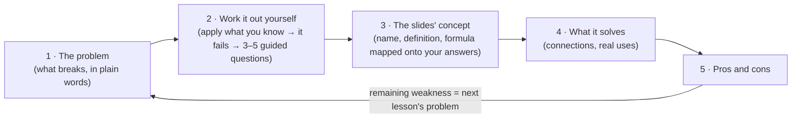

# lecture-note

**Turn lecture slides into notes that *teach*, not notes you memorise.**

[](https://claude.com/claude-code)
[](https://obsidian.md)
[](LICENSE)

Slides are a list of answers. You read *"BatchNorm: normalise each channel with the mini-batch mean
and variance"*, nod, and forget it by Friday, because you never had the problem it solves.

`lecture-note` is a [Claude Code](https://claude.com/claude-code) skill that reads a lecture PDF and
writes a step-by-step **teaching note** into your Obsidian vault. Every idea arrives the way a
good tutor would bring it in: first the problem, then you try what you already know, you watch it
break, and only then the slides give the fix a name. It can also **tutor you live** on any
section, one question at a time.

---

## What it feels like

The slide says:

> **Batch Normalization.** Use mini-batch statistics; at inference use running mean and variance.

The note tells one story instead, and keeps it from the first BatchNorm lesson to the last:

> Our cat classifier's layer 1 outputs **2, 4, 6, 8** for four training images, and layer 2 has
> learned *"above 5 means cat"*. After one training step layer 1 outputs **6, 10, 14, 18**, and
> suddenly every image is "a cat". **What went wrong, and how would you fix it?**
> → you invent "subtract the mean, divide by the std" yourself → *that's BatchNorm*.
>
> Later the GPU fits only **2** of those 4 images: how far off is the mean now?
> Later still the model is deployed and a user uploads **one** photo (layer-1 output 7), and
> "subtract this batch's mean" gives 0 for *every* photo. What should inference use instead?
> → running statistics, and the story ends where it began: with stale statistics, the drift from
> lesson 1 comes back.

Every number in that story is checked by a script before the note is published.

## How every lesson is built



A topic that spans several lessons runs on **one scenario from start to end**, so ideas chain
together instead of piling up.

## Why it's built this way

The design isn't taste. Each rule follows a research result:

| Rule | Grounded in |
|---|---|
| One running story per topic | **Anchored instruction**: CTGV / Bransford's *Jasper* series, which targets "inert knowledge" |
| Try with old knowledge, fail, then learn the concept | **Productive failure**: Kapur; meta-analysis of 166 comparisons, better conceptual understanding and transfer (Sinha & Kapur, 2021) |
| New ideas hang on what you already know | **Meaningful learning**: Ausubel; **cognitive conflict**: Piaget |
| Guided questions, never "go figure it out" | Minimal guidance fails novices (Kirschner, Sweller & Clark, 2006) |
| The tutor never hands over the answer first | Unrestricted GPT-4 help lowered unassisted exam scores by 17%; hint-only tutors removed the harm (Bastani et al., *PNAS* 2025). A research-designed AI tutor doubled learning gains (Kestin et al., *Sci. Rep.* 2025) |
| Struggle is kept, not smoothed away | Active learners learn more but *feel* they learn less (Deslauriers et al., *PNAS* 2019) |

Full reasoning, the session notes that shaped each rule, and 17 references are in
[`references/learning-design.md`](references/learning-design.md).

## Features

**Learning first**
- **Easy → hard.** A learning ladder is planned before writing; no term is used before it is explained, and every term is re-explained in one line where a later lesson uses it.
- **Plain words as the bridge, professional terms as the destination.** Each lesson ends with *"In professional terms"*, so you can talk like a practitioner.
- **Simple main line, depth on demand.** Derivations, proofs and extras sit in collapsible *deep dive* callouts.
- **Check-ins after every part** and 10+ practice questions with folded answers.
- **Interactive tutor mode.** "Teach me WEEK 5 section 14.3, you ask and I answer." It asks one question per turn, and when you get one wrong it shows where your number came from instead of re-teaching the section.

**Trustworthy**
- **Every number verified** by a generated `verify.py` with exact arithmetic, including the numbers inside animations.
- **Grounded.** The slides are the ground truth; anything beyond them is checked online against papers or standard textbooks and cited, or marked *(to verify)*.
- **Optional strict review.** A fresh evaluator agent checks every claim and teaching rule over up to 3 fix-or-rebut rounds (`references/evaluator.md`).

**Made for Obsidian**
- **Animated SVGs for anything that moves**: optimizer steps, forward and backward passes, sliding kernels, tokens flowing through an LLM, agent loops. They are generated from code and play inside `![[file.svg]]` embeds.
- **Slide screenshots** where a picture says what text can't.
- **Course mind map (optional).** One markmap per course; every node explains *what / why / formula / example / pitfall* and links back into the notes.
- **Safe publishing.** It never overwrites edits you made in Obsidian, and every embed is checked.

**Your language.** Choose per note:

| Option | Result |
|---|---|
| `zh+en` (recommended) | Plain Chinese narrative; every technical point is stated in Chinese, then in English |
| `zh` | Chinese only, English term in parentheses on first use |
| `en` | English throughout |
| `en+zh` | Plain English narrative; every technical point is stated in English, then in Chinese |
| custom | Any mix you describe |

Callout labels ("Analogy", "Deep dive", "Pause", …) follow the note language (see the label table in `references/note-template.md`).

## Quick start

```bash
pip install pymupdf cli-anything-obsidian
git clone https://github.com/RAIZ-Zzz/lecture-note-skill ~/.claude/skills/lecture-note
```

Set `OBSIDIAN_VAULT` and `OBSIDIAN_API_KEY` (details below), open your vault in Obsidian, then in
Claude Code:

```text
/lecture-note AI6103 5 "slides/Lecture 4.pdf" --lang zh+en
```

or *"teach me WEEK 5 section 14.3, you ask and I answer"*.

## Installation on a new machine

The skill holds nothing machine-specific, so nothing in this repo needs editing.

### Required

1. [Claude Code](https://claude.com/claude-code).
2. Python 3 and the two packages the scripts use (both on PyPI):
   ```bash
   pip install pymupdf cli-anything-obsidian
   ```
   On macOS / Linux the command may be `python3` / `pip3`.
3. [Obsidian](https://obsidian.md), with your vault open whenever the skill runs:
   - install and enable the community plugin **Local REST API**;
   - copy its API key into the environment variable `OBSIDIAN_API_KEY`.

   Check: `cli-anything-obsidian --json vault list` prints your vault's top-level folders.
4. The environment variable `OBSIDIAN_VAULT` = absolute path of that same vault folder
   (attachments are copied there on disk; the publish script refuses to run if it is not the
   vault Obsidian has open).
5. The skill itself:
   ```bash
   git clone https://github.com/RAIZ-Zzz/lecture-note-skill ~/.claude/skills/lecture-note
   ```
   Update later with `git pull`. Without git, download the zip and unpack it to the same folder.

Notes go to `Lecture Notes/<course>/` inside the vault; create one folder per course there.

### Optional

- Google Chrome or Microsoft Edge, only for previewing animation frames. Set `$CHROME` if it is
  not in a standard location.
- `local.md`: a two-column table (`| Vault folder | Slides |`) listing where each course's slides
  live on this machine. It is git-ignored. Without it, the skill asks for the PDF path and offers
  to create the file.
- The Obsidian plugin **Mindmap NextGen**, only for the optional course mind map.

### Use

`/lecture-note <course> <week> [pdf path] [pages A-B] [--lang zh|en|zh+en|en+zh]`, or ask it to
teach a section of an existing note.

## Under the hood

| Path | Purpose |
|---|---|
| `SKILL.md` | The workflow and writing rules Claude follows |
| `references/learning-design.md` | Why the notes teach this way: principles, session notes, references |
| `references/note-template.md` | Frontmatter and section skeleton of a note |
| `references/evaluator.md` | Prompt for the optional strict-review loop |
| `scripts/prep_slides.py` | PDF → text with page markers, overview contact sheets and slide screenshots (PyMuPDF) |
| `scripts/svg_anim.py` | `Scene` helper that builds animated SVGs from computed data; `lint` checks Obsidian compatibility; `frames` renders chosen moments with headless Chrome/Edge for visual review |
| `scripts/mindmap.py` | Optional course mind map: an outline with `@week\|heading@` link tokens becomes an inline `markmap` note; every heading link is checked |
| `scripts/publish_note.py` | Writes the note and attachments into the vault through `cli-anything-obsidian`, refuses to overwrite edits made in Obsidian, and checks that every embed resolves |

### How animations stay accurate

1. Positions are computed by a generator script from the same numbers used in the note, never typed by hand.
2. `svg_anim.py lint` enforces SMIL-only animation on one shared looping timeline (no scripts, click triggers or CSS keyframes, which do not run when Obsidian embeds an SVG as an image), an opaque background for dark themes, and a CJK font stack.
3. `svg_anim.py frames` pauses the timeline at chosen times and screenshots each frame, so every key moment is checked against the text before publishing.
4. Every animation is followed by a static table of the same numbers, so the note still works if the animation does not play.

## License

MIT, see [LICENSE](LICENSE).
