# Example: Einstein 1905, *On the Electrodynamics of Moving Bodies*

A complete note generated by `learn-like-an-engineer` (then called `lecture-note`) from one PDF, as a showcase of what the skill produces.

> [!CAUTION]
> **This note has not been validated.** The optional independent review (the evaluator loop in
> [`references/evaluator.md`](../../references/evaluator.md), "strict review") was **not** run on it.
> It did pass the default checks: every number was recomputed by a `verify.py` script, the four
> claims that go beyond the paper were checked against their primary sources online, the house-style
> lint passed, and two rounds of the student test (a fresh agent answering every question before
> reading the answer) found no arithmetic errors, while their wording issues were fixed.
> It may still contain mistakes. Read it critically.

## Input

- **Original paper:** Einstein, A. (1905). Zur Elektrodynamik bewegter Körper. *Annalen der Physik*,
  17 (4th series; volume 322 in the journal's continuous numbering), 891–921.
  <https://doi.org/10.1002/andp.19053221004>
- **PDF used as input:** the Fourmilab edition of the 1923 Perrett & Jeffery English translation,
  24 pages, public domain: <https://www.fourmilab.ch/etexts/einstein/specrel/specrel.pdf>
  (HTML version: <https://www.fourmilab.ch/etexts/einstein/specrel/www/>)
- **Command:** `/learn-like-an-engineer "Example for skill" specrel.pdf en`, with the request that the reader is a
  student in 1905 who must learn relativity.
- **Running story (chosen by the user from three candidates):** the Bern express. Stations A and B
  are 300 km apart, so light takes 1 ms; an imagined express runs at 0.6c (β = 1.25), 300 km long at
  rest; in Part 2 it carries a laboratory car with a magnet, a coil, a mirror and a cathode-ray tube.

## Output

- [`Special Relativity 1905.md`](Special%20Relativity%201905.md): an Obsidian note in English, 16
  lessons covering all 24 pages, 60 question folds, 14 exercises, a glossary and references. Its
  embeds use Obsidian vault paths (`![[Lecture Notes/Example for skill/attachments/…]]`), so on
  GitHub the images do not render inside the note; they are all in [`attachments/`](attachments).
- 2 crops of the original paper and 6 animated SVGs (SMIL only, no scripts, so they play on GitHub):

| | |
| --- | --- |
|  §1 Synchronising two clocks with light |  §2 Simultaneity is relative |
|  §4 Length contraction and time dilation |  §5 Adding velocities |
|  §7 Doppler effect for a receding observer |  §10 Kinetic energy: Einstein vs Newton |

Every position and caption number in the animations is computed by the same code that verifies the
note, never typed by hand.
